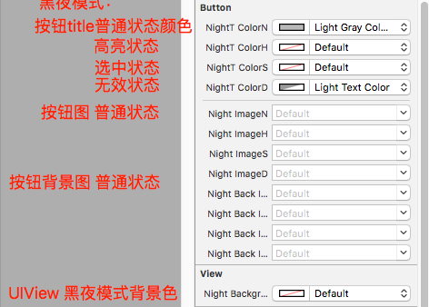

#仿知乎日报iOS客户端
##不是高仿，不是精仿
##有夜间模式
#:

#:

#黑夜模式，比如：
	#import "WMNightManager.h"
	
    if ([WMNightManager currentStatus] == WMNightStatusNight) {
        [WMNightManager dawnComing];
    } else {
        [WMNightManager nightFalling];
    }
    
	titleLbl.textColor = kDayColor;
	titleLbl.nightTextColor = kNightColor;

###支持storyboard设置，比如：
    

###可以直接拖入使用或者：                         
###pod 'WMNightManager', :git => 'https://github.com/emilyZhouwm/zhihu.git'
###或者
###pod 'WMNightManager', '~> 1.0.0'

##其他欢迎star
###带推拉效果的广告轮播
https://github.com/emilyZhouwm/WMADPageView
###各种效果的分段选择和下拉列表，二级下拉列表，可自定义列表样式
https://github.com/emilyZhouwm/segmentAndList
###微信、微博、QQ、facebook第三方登录授权，并获得昵称和头像
https://github.com/emilyZhouwm/auth
###广告轮播。使用简单。无限循环、拉伸放大、加载网络图片、定义位置和样式动效果
https://github.com/emilyZhouwm/adPage

###高仿“什么值得买”(以前)的界面表现
http://v.youku.com/v_show/id_XOTE5ODA5OTMy.html